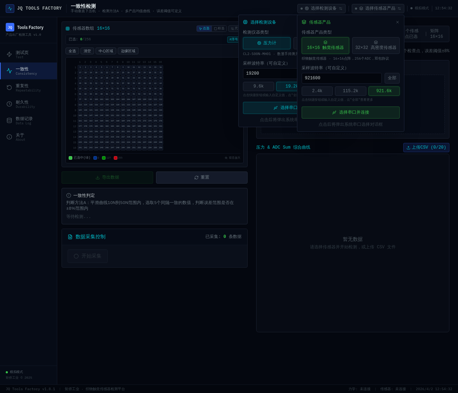
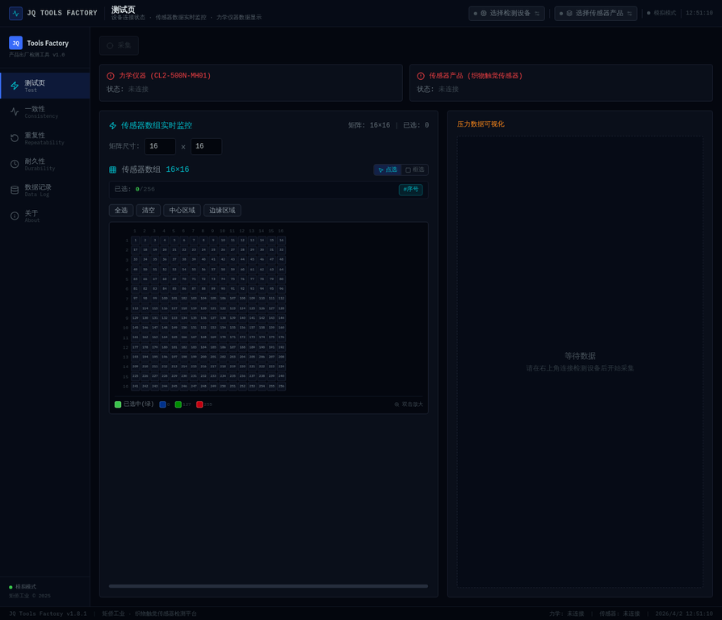
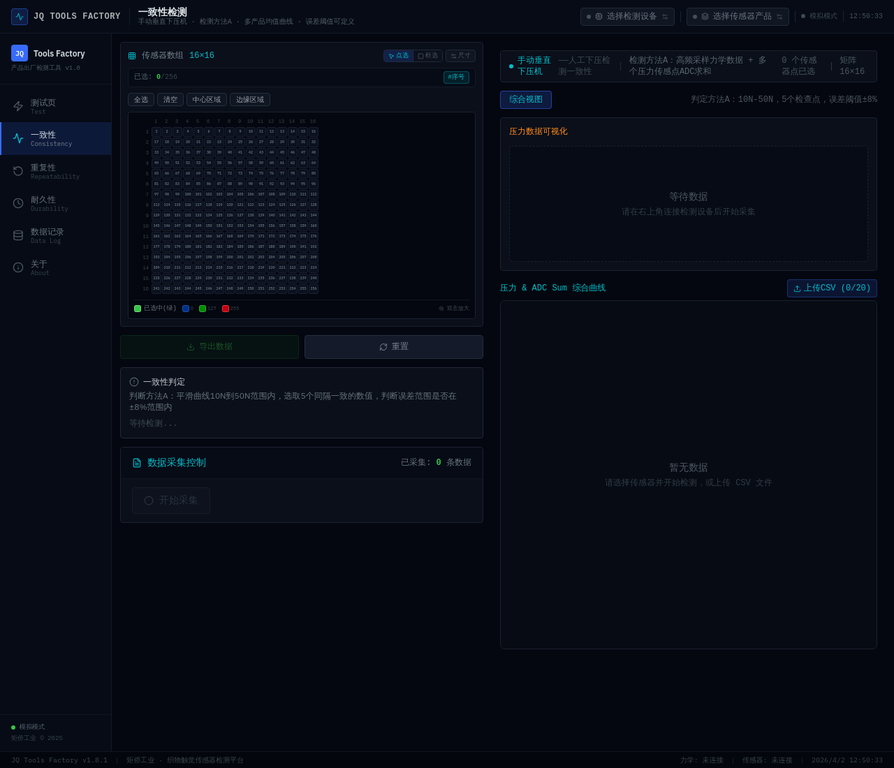
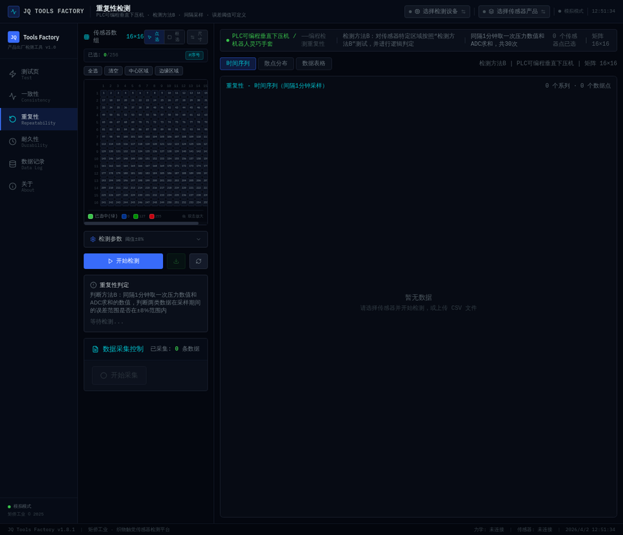
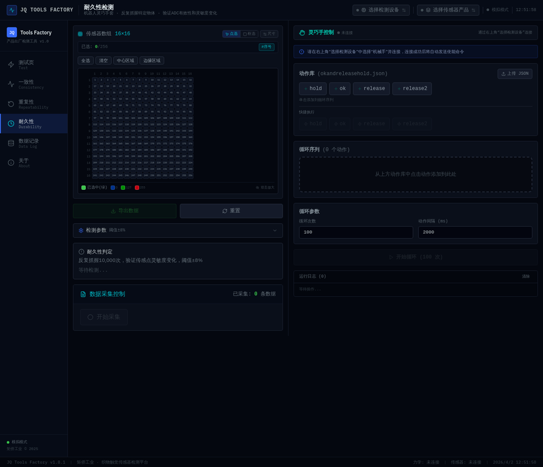
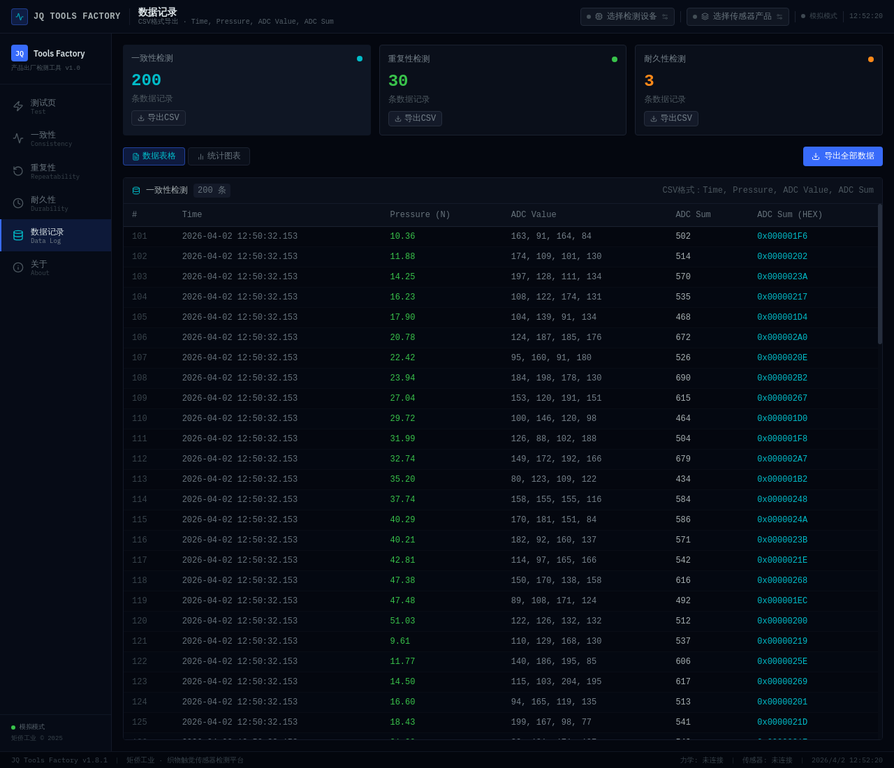

# JQ Tools Factory 软件操作说明书

**版本：** v1.8.4  
**更新日期：** 2026-04-02  
**开发商：** 矩侨工业

---

## 1. 软件简介

JQ Tools Factory 是一款专为织物触觉传感器设计的出厂检测工具。该软件基于 Web Serial API 技术，能够直接在浏览器中与硬件设备进行串口通信，实现压力计和传感器数据的实时采集、可视化展示以及自动化检测分析。

软件主要支持以下核心功能：
- **实时数据监控**：支持 16×16 和 32×32 矩阵传感器的实时热力图展示，以及压力计数据的同步曲线绘制。
- **一致性检测**：通过手动垂直下压机，采集多产品数据并绘制均值曲线，自动判断误差是否在设定阈值内。
- **重复性检测**：配合 PLC 可编程垂直下压机，进行间隔采样并分析数据重复性误差。
- **耐久性检测**：连接机器人灵巧手套，执行自动化循环抓握测试，验证传感器 ADC 的有效性和灵敏度变化。
- **数据管理**：支持测试数据的本地存储、CSV 格式导出与历史数据回放。

---

## 2. 设备连接与配置

在使用任何检测功能前，必须先完成硬件设备的连接与配置。软件支持同时连接两个 USB 串口设备。

### 2.1 连接力学检测设备
1. 点击界面右上角的 **“选择检测设备”** 按钮。
2. 在弹出的面板中，选择设备类型（默认为“压力计”）。
3. 确认波特率设置（CL2-500N-MH01 压力计默认波特率为 `19200`）。
4. 点击 **“选择串口并连接”**，在浏览器弹出的串口选择对话框中，选中对应的 COM 端口并点击“连接”。

### 2.2 连接被测传感器产品
1. 点击界面右上角的 **“选择传感器产品”** 按钮。
2. 选择传感器类型（如“16×16 触觉传感器”或“32×32 高密度传感器”）。
3. 确认波特率设置（标准传感器为 `115200`，高密度传感器为 `921600` 或 `1000000`）。
4. 点击 **“选择串口并连接”**，在浏览器弹出的对话框中选择对应的 COM 端口。

> **注意：** 首次连接时，浏览器可能会提示授予串口访问权限，请允许授权。连接成功后，状态栏会显示“已连接”及实时数据刷新动画。

---

## 3. 核心功能模块

### 3.1 测试页 (Test)

测试页主要用于设备的初步调试和实时数据监控，不进行复杂的逻辑判定。

**主要功能：**
- **传感器矩阵视图**：左侧显示传感器阵列的实时热力图。您可以通过“点选”或“框选”工具选择特定的传感器节点进行重点监控。
- **显示模式切换**：当连接特定手套设备（如左手 LH 或右手 RH）时，矩阵上方会出现 **“手掌布局”** 和 **“矩阵显示”** 的 Tab 切换按钮，方便您在直观的手形图和标准网格图之间自由切换。
- **压力数据可视化**：右侧图表实时绘制压力计传回的力学数据曲线，帮助您直观观察施力变化。
- **数据采集**：点击左侧的“开始采集”按钮，软件将同步记录选定传感器节点的数据和压力数据，采集完成后可导出为 CSV 文件。

### 3.2 一致性检测 (Consistency)

一致性检测用于验证同一批次传感器在相同受力条件下，输出数值的一致性。

**操作流程：**
1. 在左侧矩阵中选择需要检测的传感器区域。
2. 在左下角的“检测参数”面板中，确认误差阈值（默认 ±8%）。
3. 点击 **“开始采集”**。
4. 使用手动垂直下压机对传感器施加压力（建议在 10N 到 50N 范围内平滑施力）。
5. 软件会自动记录高频力学数据和传感器 ADC 求和数据。
6. 采集完成后，软件会在右侧的“综合视图”中绘制压力与 ADC 的综合曲线，并在 10N-50N 范围内自动选取 5 个检查点，判断误差是否在阈值范围内。

### 3.3 重复性检测 (Repeatability)

重复性检测用于验证传感器在多次重复受力下，输出数值的稳定性。

**操作流程：**
1. 确保已连接 PLC 可编程垂直下压机。
2. 在左侧矩阵中选择检测区域。
3. 点击 **“开始检测”**。
4. PLC 将按照预设程序，每隔 1 分钟自动下压一次，共进行 30 次采样。
5. 软件会记录每次采样的压力数值和 ADC 求和数值。
6. 测试结束后，您可以通过右侧的“时间序列”、“散点分布”和“数据表格”标签页查看详细的重复性分析结果。

### 3.4 耐久性检测 (Durability)

耐久性检测配合机器人灵巧手套，通过长时间的循环动作，验证传感器的寿命和灵敏度衰减情况。

**操作流程：**
1. 在右上角“选择检测设备”中，将设备类型切换为 **“机械手”** 并连接。
2. 连接成功后，软件会自动向机械手发送使能命令。
3. 在右侧的“灵巧手控制”面板中，您可以点击预设的动作按钮（如 `hold`, `ok`, `release`）将其添加到下方的“循环序列”中。
4. 在“循环参数”区域设置循环次数（如 10000 次）和动作间隔时间。
5. 点击 **“开始循环”**，机械手将自动执行序列动作，软件同步记录传感器数据，以验证长期使用后的 ADC 有效性。

### 3.5 数据记录 (Data Log)

数据记录页面集中管理所有检测模块产生的历史数据。

**主要功能：**
- **分类查看**：数据按“一致性检测”、“重复性检测”和“耐久性检测”分类展示。
- **数据详情**：提供详细的数据表格，包含时间戳 (Time)、压力值 (Pressure)、ADC 原始值 (ADC Value) 和 ADC 求和值 (ADC Sum)。
- **数据导出**：您可以针对单次测试记录点击“导出CSV”，或点击右上角的“导出全部数据”将所有记录打包下载，方便后续使用 Excel 或 Python 进行深度分析。

---

## 4. 常见问题与注意事项

1. **浏览器兼容性**：本软件依赖 Web Serial API，请务必使用 **Chrome 89+** 或 **Edge 89+** 浏览器访问。
2. **串口占用**：如果连接失败，请检查串口是否被其他软件（如串口调试助手）占用。
3. **数据刷新卡顿**：在 32×32 高密度模式下，数据量较大。软件已内置节流优化，但仍建议关闭不必要的后台程序以保证流畅度。
4. **离线使用**：本工具为纯前端 Web 应用，加载完成后，即使断开网络连接，依然可以正常进行串口通信和数据采集。

---
*文档生成于 2026年4月2日*
